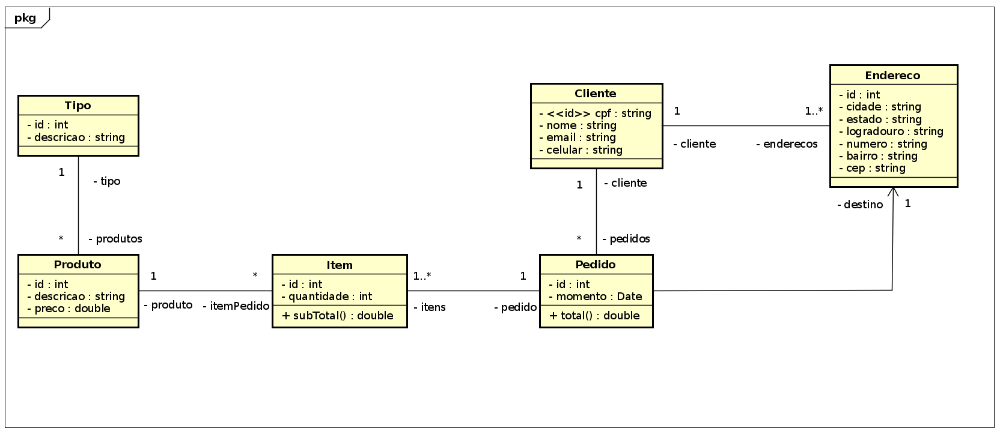

# Projeto Integrador - Nuance Store - Backend

Por [Ruan Azevedo](https://www.github.com/azevedoruan), [Pedro Luiz Ellero](https://www.github.com/PedroEllero), {Hugo Okumura}(https://github.com/HugoOkumura) e Marcos Paulo Oliveira.

## Sobre o projeto

Este é um projeto para a disciplina de **Projeto Integrador** da UTFPR de Campo Mourão. O Objetivo dessa disciplina é criar uma aplicação Web integrando todos os aspectos relacionado ao desenvolvimento Web do back-end ao front-end, utilizando as mais diversas tecnologias do mercado.

Nosso projeto específico é uma loja virtual (e-commerce) de sapatos e bolsas. A loja apresenta uma tela de vendas que exibe uma variedade de calçados com filtros apropriados, e outra tela que exibe as bolsas.

## Modelo conceitual

## Tecnologias utilizadas

- Python
- Django
- MySQL
